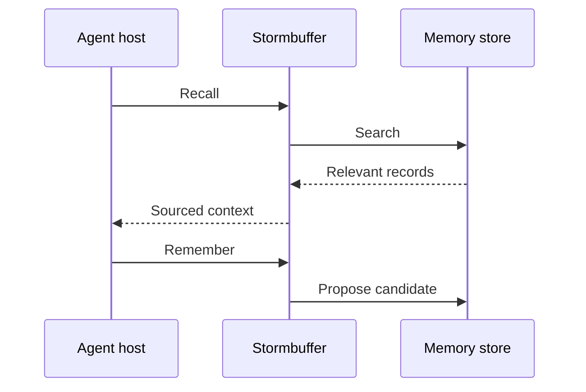

# Stormbuffer

Stormbuffer is a local-first memory store for sourced facts, decisions,
procedures, and project checkpoints, keeping memories as human-readable
Markdown.

## Usage

To install Stormbuffer, clone the repo and build with cargo, then initialize
the store and download the embedding model:

```sh
cargo install --path crates/cli --locked
sbuf init
```

To add and retrieve memories:

```sh
sbuf add --title "Release constraint" --kind fact
sbuf list
sbuf search release
sbuf context release --budget 400
```

`sbuf add` opens an editor for the record body and source.

Use a project store when you feel that knowledge belongs to one repository:

```sh
cd path/to/project
sbuf --project init
sbuf --project add --title "Test command" --kind procedure
sbuf --project search test
```

Agents can use the versioned JSON protocol without prompts or human-formatted
output:

```sh
printf '%s\n' \
  '{"version":1,"query":"release process","budget":400}' \
  | sbuf --project invoke context
```

### Further Reading

See the [installation guide](docs/src/content/docs/installation.md) or
[quick start](docs/src/content/docs/quick-start.md), and
[MCP setup](docs/src/content/docs/reference/mcp.md) for complete setup and
integration instructions.

## Architecture

The CLI, JSON protocol, and MCP server call the `stormbuffer-core` crate, which owns
validation, storage, indexing, and retrieval.

Stormbuffer keeps Markdown with TOML frontmatter as canonical records, while SQLite metadata, &
full-text search, and vector indexes are disposable projections that the engine can rebuild.



To learn more, read about the [memory loop](docs/src/content/docs/concepts/memory-workflow.md),
where we explain what belongs in Stormbuffer and what should remain temporary agent context.
[Architecture](docs/src/content/docs/concepts/architecture.md) covers storage and retrieval
design in more detail.
