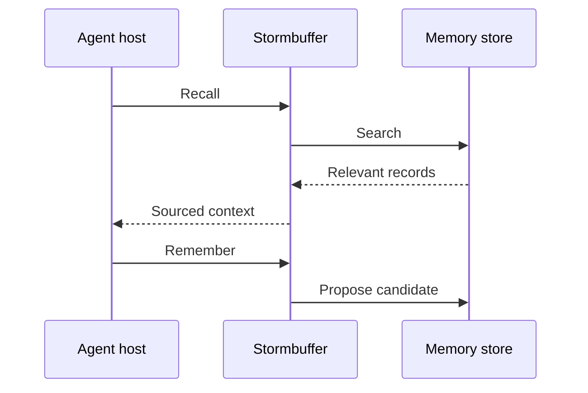

# Stormbuffer

Stormbuffer is a local-first memory store for sourced facts, decisions,
procedures, and project checkpoints, keeping memories as human-readable
Markdown.

## Usage

To install Stormbuffer, clone the repo and build with cargo, then initialize
the store and download the embedding model:

```sh
cargo install --path crates/cli --locked
sbuf init
```

To add and retrieve memories:

```sh
sbuf add --title "Release constraint" --kind fact
sbuf list
sbuf search release
sbuf context release --budget 400
```

`sbuf add` opens an editor for the record body and source.

Use a project store when you feel that knowledge belongs to one repository:

```sh
cd path/to/project
sbuf --project init
sbuf --project add --title "Test command" --kind procedure
sbuf --project search test
```

`--project` combines the nearest project store with applicable global memory.
Use `--local` for strict nearest-store retrieval that never opens the global
store. Project identity is stored in `.sbuf/store.toml`, so renaming the
repository does not change its memory scope.

Agents can use the versioned JSON protocol without prompts or formatted output:

```sh
printf '%s\n' \
  '{"version":1,"query":"release process","budget":400}' \
  | sbuf --project invoke context
```

## Agent installation

Stormbuffer is not released yet. The commands below install from the current
source checkout.

### Skill

Install the project-memory skill in an agent's project skill directory:

```sh
sbuf --project skill install --directory .agents/skills
```

Omit `--project` to install the global-memory variant. See the
[agent skill guide](packages/docs/src/content/docs/workflows/agent-skill.md) for
scope and installation-directory choices.

### MCP

Build the MCP server, then register its read-only project view with Codex:

```sh
cargo install --path crates/mcp --locked
codex mcp add stormbuffer -- stormbuffer-mcp --stdio --project
```

Other hosts can start the same stdio command. The
[MCP guide](packages/docs/src/content/docs/reference/mcp.md) covers Pi, global
and local scopes, write access, resources, and tools.

### Lifecycle plugins

Prepare the workspace before installing either local plugin:

```sh
corepack enable
pnpm install --frozen-lockfile
```

Install the Codex plugin from the repository root:

```sh
codex plugin marketplace add "$PWD"
codex plugin add stormbuffer@stormbuffer-source
```

Install the Pi plugin from the same checkout:

```sh
pi install "$PWD/packages/pi-plugin-stormbuffer"
```

Keep the checkout in place after installation. See the detailed
[Codex](packages/docs/src/content/docs/workflows/codex-plugin.md) and
[Pi](packages/docs/src/content/docs/workflows/pi-plugin.md) plugin guides for
scope selection, verification, updates, and removal.

## Further reading

See the [installation guide](packages/docs/src/content/docs/installation.md) or
[quick start](packages/docs/src/content/docs/quick-start.md), and
[source build guide](packages/docs/src/content/docs/workflows/source-build.md)
for complete setup instructions.

## Architecture

The CLI, JSON protocol, and MCP server call the `stormbuffer-core` crate, which owns
validation, storage, indexing, and retrieval.

Stormbuffer keeps Markdown with TOML frontmatter as canonical records, while SQLite metadata, &
full-text search, and vector indexes are disposable projections that the engine can rebuild.



To learn more, read about the [memory loop](packages/docs/src/content/docs/concepts/memory-workflow.md),
where we explain what belongs in Stormbuffer and what should remain temporary agent context.
[Architecture](packages/docs/src/content/docs/concepts/architecture.md) covers storage and retrieval
design in more detail.
